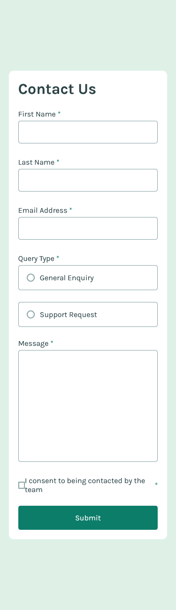
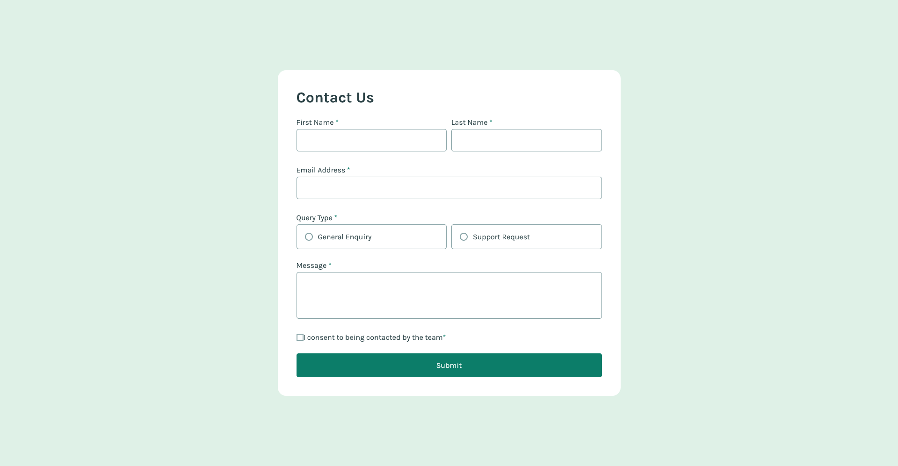

## Overview
This is my solution for front-end mentor challenge name: [Contact form](https://www.frontendmentor.io/challenges/contact-form--G-hYlqKJj)

### Screenshot
Mobile view\

desktop view\

### Demo
[FireShot](https://wajidkhan2-frontendmentor-challenges.github.io/Contact-form-html-css-js-jquery/)

### Built with
- Mobile-first workflow
- Semantic HTML5 markup
- CSS custom properties
- JS and jquery

### What I learned 
I learned ARIA, i also learned about different type of accessibility.
How to work with screen readers and make the design to work for us but also for screen readers also.

### issues 
There is one issue with this project is that when screen reader get form error and enter on the redirection link
it does not redirecting correctly to the input field but it works correctly for everything else.

### Author 
[wajidkhan2](https://github.com/wajidkhan2)
